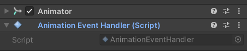
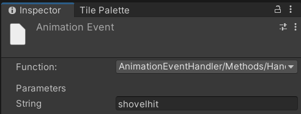

# Animation Event Handler for Unity

> [!NOTE]\
> Feel free to contribute or report any issues.

- This script, `AnimationEventHandler`, lets you ditch the old way of needing scripts and animation events on the same GameObject. Now, scripts anywhere in your scene can subscribe to animation events triggered by any Animator!

## Features
- **Decoupled Event Handling**: Separates animation events from responding scripts, promoting better code organization and maintainability.
- **Concurrent Dictionary**: Utilizes a ConcurrentDictionary for efficient and thread-safe event management.
- **Error Reporting**: Logs warnings or errors in the Unity Editor.

## Usage
- Copy the `AnimationEventHandler.cs` script inside your Unity project. Then make sure to call `HandleAnimationEvent()` in an Animation Event.




> [!WARNING]\
> This script only lets you subscribe to each animation event **ONCE**. Subscribing twice can cause problems in your game.
> For multiple actions, try combining logic or use follow-up events.

- Example usage
```cs
using UnityEngine;

public class Shovel : MonoBehaviour
{
    [Header("Example")]
    [SerializeField] private AnimationEventHandler animationEventHandler;
    [SerializeField] private Animator animator;

    void Awake()
    {
        animationEventHandler.Subscribe("shovelhit", OnShovelHit); // Event name isn't case-sensitive.
    }

    void OnDestroy()
    {
        animationEventHandler.Unsubscribe("shovelhit");
    }

    private void OnShovelHit()
    {
        // This method gets executed each time it's called by an animation event.
    }
}
```